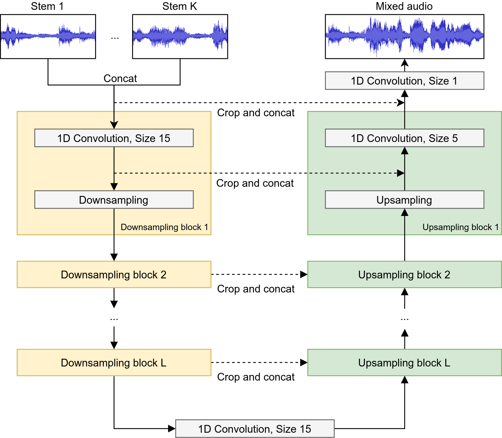

# Intelligent drum mixing with the Wave-U-Net
Implementation of the [Mix-Wave-U-Net](https://www.aes.org/e-lib/browse.cfm?elib=21023) for automatic mixing of drums.

## Listening examples

Listen to drum mixing results [here](https://mchijmma.github.io/drum-mixing-wave-u-net/).

## What is the Mix-Wave-U-Net?
The Wave-U-Net is a convolutional neural network applicable to audio source separation tasks, which works directly on the raw audio waveform, presented in [this paper](https://arxiv.org/abs/1806.03185).

We adapted the architecture slightly and applied it to the task of mixing a set of stem recordings into a full music mixture.

See the diagram below for a summary of the network architecture.



# Installation

## Requirements

GPU strongly recommended to avoid very long training times (CUDA 10.0 required)

The project is based on Python 3.6 and requires [libsndfile](http://mega-nerd.com/libsndfile/) to be installed.

Then, the following Python packages need to be installed:

```
numpy==1.18.3
sacred==0.8.1
tensorflow-gpu==1.15.2
librosa==0.7.2
soundfile==0.10.3.post1
lxml==4.5.0
google
protobuf
soundfile
tqdm
```

Instead of ``tensorflow-gpu``, the CPU version of TF, ``tensorflow`` can be used, if there is no GPU available.

All the above packages are also saved in the file ``requirements.txt`` located in this repository, so you can clone the repository and then execute the following in the downloaded repository's path to install all the required packages at once:

``pip install -r requirements.txt``

### Download datasets

To directly use the pre-trained models we provide for download to separate your own songs, now skip directly to the [last section](#test), since the dataset is not needed in that case.

To reproduce the experiments in the paper (train all the models), you need to download the [ENST dataset](https://sigsep.github.io/datasets/musdb.html) and extract it into a folder of your choice. It should then have "drummer_1", "drummer_2" and "drummer_3" subfolders in it.

### Set-up filepaths

Now you need to set up the correct file paths for the dataset and the location where outputs should be saved.

Open the ``Config.py`` file, and set the ``enst_path`` entry of the ``model_config`` dictionary to the location of the main folder of the ENST dataset.
Also set the ``estimates_path`` entry of the same ``model_config`` dictionary to the path pointing to an empty folder where you want the final model outputs to be saved into.

## Training the models / model overview

Since the paper investigates many model variants of the Wave-U-Net and also trains the [U-Net proposed for vocal separation](https://ismir2017.smcnus.org/wp-content/uploads/2017/10/171_Paper.pdf), which achieved state-of-the-art performance, as a comparison, we give a list of model variants to train and the command needed to start training them:

| Model name (from paper) | Description                                             | Command for training                          |
|-------------------------|---------------------------------------------------------|--------------------------------------|
| Dry                      | Wave-U-Net for dry mixing task                         |``python Training.py with cfg.context_dry``                            |
| Wet                      | Wave-U-Net for wet mixing task                         | ``python Training.py with cfg.context_wet``         |

# <a name="test"></a> Test trained models on songs!

## Downloading our pretrained models

We provide pre-trained models so you can mix your own collection of drum recordings right away, see the [Github release section](https://github.com/f90/Mix-Wave-U-Net/releases) for downloads.
Unzip the obtained archive into the ``checkpoints`` subfolder in this repository, so that you have one subfolder for each model (e.g. ``REPO/checkpoints/dry``)

## Run pretrained models

For a quick demo on a set of drum stems using the wet mixing model, simply execute

`` python Predict.py with cfg.context_wet ``

which will mix the drum stems contained in this repository's ``audio_examples/inputs`` subfolder. The output will be saved into ``audio_examples/outputs``.

To use the dry model on the example inputs, use

`` python Predict.py with cfg.context_dry output_path=audio_examples/outputs/dry_mix.wav model_path=checkpoints/dry/dry-460000``

which loads the model checkpoint file of the dry model fitting to the model configuration that is used.
``output_path`` specifies a custom output file path for the mixture audio.

To use the model on your own inputs, add the ``input_path`` parameter to the command-line arguments. For example, to set the ``tom_2`` input to ``PATH``, use ``input_path={'tom_2':PATH}``. Set ``PATH`` to ``None`` if you don't want to use this particular stem for mixing. See ``Config.py``for details.  
